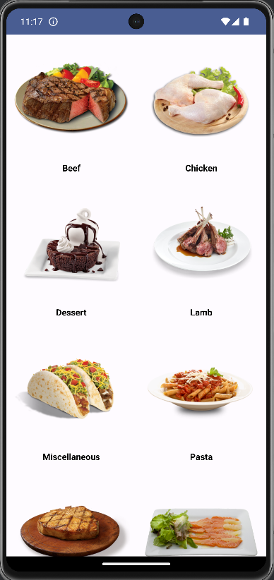
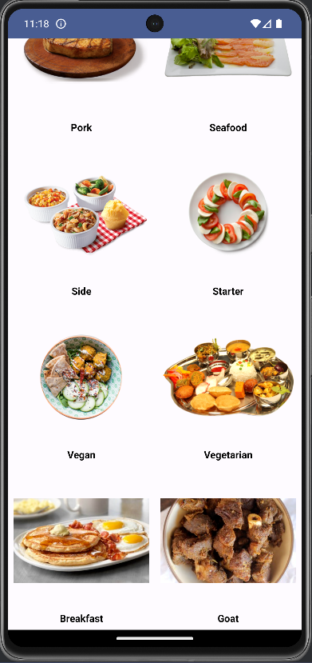
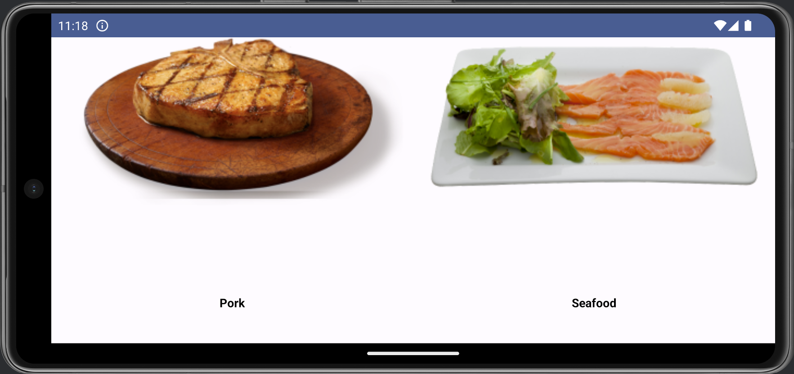
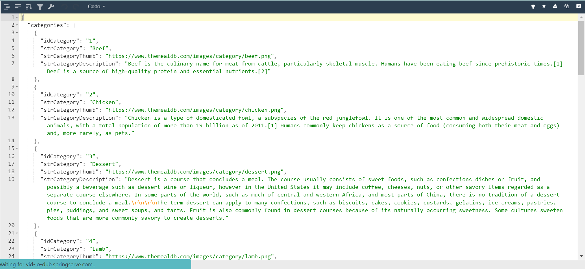

# MyRecipeApp

MyRecipeApp is a modern Android application built with Jetpack Compose and Retrofit, allowing users to explore a vast array of recipes categorized neatly. It leverages the MealDB API to fetch recipe data, providing users with an immersive cooking experience right from their mobile devices.

## Features
- **Recipe Categories**: Browse through a diverse collection of recipe categories, ranging from appetizers to desserts.
- **Dynamic UI**: Utilizes Jetpack Compose to create a dynamic and interactive user interface, providing a seamless user experience.
- **Category Grid Layout**: Displays recipe categories in a visually appealing grid layout, making it easy for users to explore and choose their desired category.
- **Responsive Design**: Ensures optimal viewing experience across various screen sizes and orientations, providing consistency and usability.
- **Loading Indicator**: Shows a loading indicator while fetching data from the MealDB API, ensuring users are aware that content is being loaded.
- **Error Handling**: Gracefully handles errors that may occur during data fetching, providing informative messages to guide users.
- **Dark Mode Support**: Seamlessly adapts to the user's device preferences, supporting both light and dark modes for comfortable viewing.

## Screenshots
<!-- Include screenshots or GIFs of your app here to give users a visual representation of what your app looks like. -->
 
&nbsp;&nbsp;

<!-- -->

<!-- -->


## Tech Stack
- **Kotlin**: The primary programming language used for Android app development.
- **Jetpack Compose**: A modern toolkit for building native Android UI, providing a declarative and reactive approach to UI development.
- **Retrofit**: A type-safe HTTP client for Android and Java, used for making network requests and handling API interactions.
- **Coil**: An image loading library for Android, used for efficient and seamless image loading and caching.

## Installation
1. Clone the repository:
    ```bash
    git clone https://github.com/nishkarsh25/MyRecipeApp.git
    ```
2. Open the project in Android Studio.
3. Build and run the project on an emulator or physical device.

## Usage
1. Launch the app on your device.
2. Browse through the recipe categories displayed on the home screen.
3. Tap on a category to view recipes within that category.
4. Explore recipe details and enjoy cooking!

## Contributing
Contributions are welcome! If you find any bugs, want to suggest new features, or improve existing functionality, please follow these steps:
1. Fork the repository.
2. Create a new branch (`git checkout -b feature/improvement`)
3. Make your changes and commit them (`git commit -am 'Add new feature'`)
4. Push to the branch (`git push origin feature/improvement`)
5. Create a new Pull Request.

## License
This project is licensed under the [The 3-Clause BSD License](LICENSE).

## Contact
If you have any questions or suggestions, feel free to contact the project owner:

Author: Nishkarsh Gupta

Email: bm21btech11016@iith.ac.in
